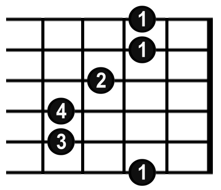
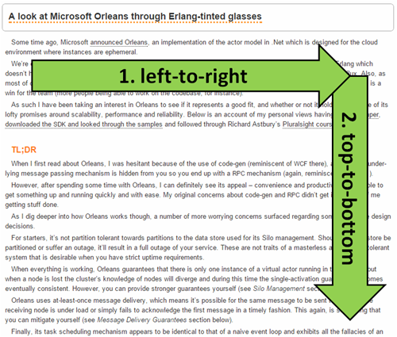
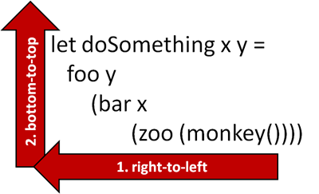
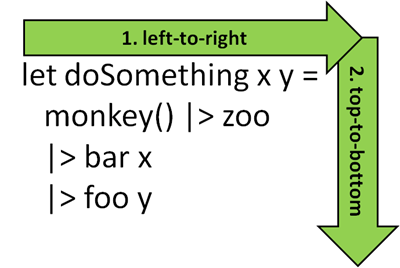
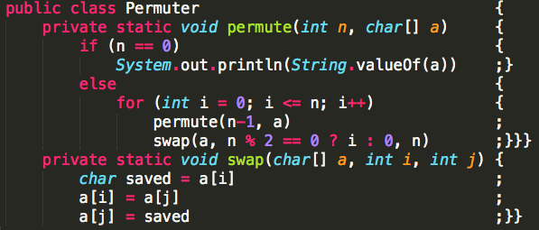
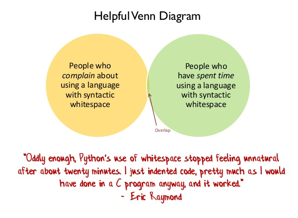

- title : Reading F#
- description : don't let syntax scare you
- author : Milosz Krajewski
- theme : beige
- transition : zoom

***

# Reading F#



### don't let syntax scare you

***

## Modern languages

|         | Classic     | Modern |
|---------|:-----------:|:------:|
| Native  | C/C++       | Rust   |
| iOS     | Objective-C | Swift  |
| JVM     | Java        | Scala  |
| Android | Java        | Kotlin |
| .NET    | C#          | F#     |

---

### What is the problem with F#?

> [...] biggest obstacles for F# [...] is that C# is a very good language. It's not like Swift vs Objective-C, where Swift is the obvious choice if you're not masochistic [...] -- [Thomas Bandt](https://thomasbandt.com/the-problem-with-fsharp-evangelism)

---

## F#

* multi-paradigm, functional first
* strongly typed, type inference
* low ceremony, concise
* expression based
* visually honest
* encourages composition

---

### Multi-paradigm, functional first

Supports both OO and FP...

...but FP is a little bit more natural in F#.

---

### Strongly typed, type inference

F# is so strongly typed that you can't even assign `int` to `double` variable...

...but at the same time it infers types if it is possible, so you rarely specify them.

---

### Low ceremony

Ceremony prevents things from being done right<br>
(ie: "two interfaces and an enumeration").

> [...] things you have to do before you can do what you really want to do [...] -- [Venkat Subramaniam](https://www.youtube.com/watch?v=4jCjDEb9KZI)

---

### Expression based

in F# everything can be an expression, even on-the-fly-anonymous-interface-implementation-expression.

```javascript
function functionA() {
    let variable;
    if (condition) { // 'if' is a statement
        variable = expressionA();
    } else {
        variable = expressionB();
    };
    return functionB(variable);
}
```

```javascript
const functionA = // '?:' is expression
    () => functionB(condition ? expressionA() : expressionB());
```

---

### Visual honesty

It does what it looks like.

```csharp
File
    .Open("people.csv")
    .ReadAllLines()
    .Select(line => Person.Parse(line))
    .Where(person => person.Age > 60)
    .Where(person => Email.IsValid(person.email))
    .Select(person => Template.Build(person.email))
    .ForEach(email => Email.Send(email));
```

---

### Conciseness

* every line of code is liability
* code not written don't have to be maintained
* less code has lower cognitive load (you can actually read it)
* write less code, deliver more is the same time
* logic fits one screen therefore it is easier to reason about

---

### Composition

Building isolated, easy to test small pieces which come together at the end.

---

### Venkay says...

| JVM   | .NET |
|:-----:|:----:|
| Java  | C#   |
| Scala | F#   |

***

## Primitive types

```fsharp
() // unit
true // bool
1234 // int
1234.5678 // float
"hello" // string
'c' // char
```

***

## 'let' Binding

```fsharp
let eight = 8
let hello = "Hello"
```

```javascript
// es6
const eight = 8;
const hello = "Hello";
```

---

```fsharp
let i = 1234
let f = 1234.5678
let s = "hello"
let c = 'c'
```

you can provide type if you really really want to

```fsharp
let i: int = 1234
let f: float = 1234.5678
let s: string = "hello"
let c: char = 'c'
```

***

## Void is a type

...and it has a value

```fsharp
let nothing: unit = ()
```

```javascript
// es6
const nothing = void 0 // undefined
```

---

### Need for void

Because `void` is not a real type in C#,
lot of generic types and related methods are implemented twice:

* `Task` and `Task<T>`
* `Action` and `Func<T>`

while:

* `Task` is `Task<Void>`
* `Action` is `Func<Void, Void>`

---

```csharp
void Forgive(Action action) {
    try { action(); } catch { /* ignore */ }
}

T Forgive(Func<T> action) {
    try { return action(); } catch { return default(T); }
}
```

---

JavaScript just does not care:

```javascript
function forgive(action) {
    try { return action(); } catch(_) { }
};

forgive(() => 8); // 8
forgive(() => { throw "bang!" }); // undefined
```

(which in this case is acually useful)

---

if you think I'm making shit up:

```csharp
public interface IServiceRestHelper
{
    Task<IRestResponse> SendRequest(
        IRestRequest request,
        ServiceType serviceType);
    Task<IRestResponse> SendRequest(
        IRestRequest request,
        ServiceType serviceType,
        int timeout);
    Task<IRestResponse<T>> SendRequest<T>(
        IRestRequest request,
        ServiceType serviceType) where T : new();
    Task<IRestResponse<T>> SendRequest<T>(
        IRestRequest request,
        ServiceType serviceType,
        int timeout) where T : new();
}
```

---

## Questions so far?

***

## Tuples

```fsharp
// Tuple<string, int>
let pair = "answer is", 42 // string * int
```

```fsharp
// Tuple<bool, string, char>
let triplet = true, "love", '!'; // bool * string * char
```

---

### Construction

```fsharp
let tuple = "answer is", 42
```

```javascript
// es6
const tuple = ["answer is", 42]; // array
```

```csharp
var tuple = new Tuple<string, int>("answer is", 42);
var tuple = Tuple.Create("answer is", 42);
```

---

### Decomposition

```fsharp
let text, value = tuple
```

```javascript
// es6
const [text, value] = tuple; // array
```


```csharp
var text = tuple.Item1;
var value = tuple.Item2;
```

---

### Complex decomposition

```fsharp
let tuple = "answer is", 42
let (answer, number), pi = tuple, 3.14
```

---

```fsharp
let _, value = "no one cares", 1337 // string * int
let _, _, third = 1, 2, 3 // int * int * int
```

```javascript
let [_, value] = ["no one cares", 1337];
let [_, _, third] = [1, 2, 3]; // BANG!
```

***

## Function types

Every function has one argument and result:

`Func<Request, Response>`

`Request -> Response`

---

|:----------------|-----------------------:|
| `Action`        | `Func<void, void>`     |
| `Action<T>`     | `Func<T, void>`        |
| `Func<T>`       | `Func<void, T>`        |
| `Func<A, B, C>` | `Func<Tuple<A, B>, C>` |
| `Func<A, B, C>` | `Func<A, Func<B, C>>`  |

---

### F#

`Func<A, B>`

is

`'A -> 'B`

---

| C#                     | F#                 |
|:----------------------:|:------------------:|
| `Action`               | `unit -> unit`     |
| `Action<T>`            | `'T -> void`       |
| `Func<T>`              | `unit -> 'T`       |
| `Func<Tuple<A, B>, C>` | `('A * 'B) -> 'C`  |
| `Func<A, Func<B, C>>`  | `'A -> ('B -> 'C)` |

---

Functions with many arguments in F# are either:

* `a -> b -> c -> d`
* `(a * b * c) -> d`

or combination of both:

* `a -> (b * c) -> d`

---

...you do this in JavaScript sometimes:

```javascript
let alice = (a, b, c) => { ... };
let frank = (a) => (b) => (c) => { ... };
let steve = (a) => (b, c) => { ... };
```

although in F# it is just bread-and-butter.

---

### Signatures

```fsharp
int -> string // toString 123
string -> float // parse "987"
int -> int -> string -> unit // drawPixel x y color
(int * int) -> string -> unit // drawPixel (x, y) color
unit -> double // nextRandom ()
HttpRequest -> Task<HttpResponse> // web server
```

---

### 'a -> 'b -> 'c

```fsharp
let multiply a b = a * b // int -> int -> int
multiply 5 6
```

```javascript
// es6
const multiply = (a) => (b) => a * b;
multiply(5)(6); // 30
```

---

### 'a -> ('b -> 'c)

```fsharp
let multiply a b = a * b // int -> int -> int
let multiplyBy5 = multiply 5 // int -> int
multiplyBy5 6 // 30
```

```javascript
const multiply = (a) => (b) => a * b;
const multiplyBy5 = multiply(5);
multiplyBy5(6); // 30
```

---

### ('a * 'b) -> 'c

```fsharp
let multiply (a, b) = a * b // (int * int) -> int
multiply (5, 6) // 30
```

```javascript
// es6
const multiply = (a, b) => a * b;
multiply(5, 6);
```

***

## Lambdas

```fsharp
let multiply = fun a b -> a * b
let multiply a b = a * b
```

```javascript
const multiply = (a, b) => a * b
funtion multiply(a, b) { return a * b; }
```

---

```fsharp
let greet name = printfn "Greetings, %s!" name
let twice action = action (); action ()
twice (fun () -> greet "Alice")
```

---

Also:

```fsharp
let twice action arg = action arg; action arg
twice (fun name -> greet name) "Frank"
twice greet "Frank"
```

***

## Operators (are functions)

```fsharp
let roundUpTo interval value =
    (value + interval - 1) / interval * interval
roundUpTo 10 9 // 10
roundUpTo 10 11 // 20
```

---

Operators are just functions with fancy names

```fsharp
let (^~) value interval = roundUpTo interval value
3 ^~ 10 // as infix operator
(^~) 3 10 // as function
```

(and some complicated precedence rules)

---

```fsharp
let (|>) arg func = func arg
```

```fsharp
printfn "%d" 42
42 |> printfn "%d"
```

```fsharp
roundUpTo 10 12
12 |> roundUpTo 10
```

---

The `|>` is used all the time, so instead:

```fsharp
let file = openFile fileName
```

you can often see:

```fsharp
let file = fileName |> openFile
```

(maybe not in such simple case)

---

when functions return more than one result (as tuple)<br>
you can untangle them and pass separetely:

```fsharp
// ('a * 'b) -> 'c
let alice p =
    let (b, s) = p
    printfn "%b %s" b s
let frank (b, s) = printfn "%b %s" b s

// 'a -> 'b -> 'c
let steve b s = printfn "%b %s" b s

let pair = (true, "love")
pair |> alice
pair |> frank
pair ||> steve // note double pipe
pair ||> printfn "%b %s"
```

***

## Visual honesty



---

C# is generally left-to-right and top-down, but has islands of right-to-left'isms and bottom-up'isms:

```csharp
SendEmail(
    GenerateEmailFromTemplate(
        "YouHaveBeenSelectedTemplate",
        GetPersonsEmailAddress(
            FindPersonById(id))));
```

---

Which looks like that:



---

F# helps to sort this out using `|>` operator:

```fsharp
id
|> findPersonById
|> getPersonsEmailAddress
|> generateEmailFromTemplate "YouHaveBeenSelectedTemplate"
|> sendEmail
```

---

Which makes it:



---

although, it is binary identical to:

```fsharp
sendEmail (
    generateEmailFromTemplate "YouHaveBeenSelectedTemplate" (
        getPersonsEmailAddress (
            findPersonById id)))
```

---

### ...BTW...

---

### Pipeline is making its way to JavaScript

[Pipeline operator](https://github.com/tc39/proposal-pipeline-operator)

```javascript
const doubleSay = s => s + ", " + s;
const capitalize = s => s[0].toUpperCase() + s.substring(1);
const exclaim = s => s + '!';
```

```javascript
let resultA = exclaim(capitalize(doubleSay("hello")));
let resultB = "hello" |> doubleSay |> capitalize |> exclaim;
```

---

Witch out pipeline operator,<br>
there is no easy way to format it:

```javascript
foreach(
    map(
        filter(people, p => p.Name === "John"),
        p => p.email),
    e => invite(e));
```

---

```javascript
people
    .filter(p => p.Name === "John")
    .map(p => p.email)
    .foreach(e => invite(e));
```

***

## Indentation



---



---

What would this code print?

```fsharp
let mutable (x, y) = 0, 1
for i = 1 to 8 do
    x <- x + 1
    y <- y * 2
printfn "%d,%d" x y
```

vs

```csharp
int x = 0, y = 1;
for (var i = 1; i <= 8; ++i)
    x = x + 1;
    y = y * 2;
Console.WriteLine("{0},{1}", x, y);
```

***

## Lists

`[1; 2; 3]`

---

```fsharp
let empty = []
let listA = [1; 2; 3]
let listB = [
    1
    2
    3
]
```

---

```fsharp
let slightlyLonger = 7 :: [1; 2; 3]; // add 1 item
let slightlyLonger = [7] @ [1; 2; 3]; // add a list (with 1 item)
let slightlyLonger = 7 :: 1 :: 2 :: 3 :: []; // add many one by one
```

```fsharp
let muchLonger = [9; 8; 7] @ [1; 2; 3]; // add lists
let muchLonger = 9 :: [8; 7] @ (1 :: 2 :: [3]); // get crazy
```

***

## Records

```fsharp
type Person = {
    FirstName: string
    LastName: string
    Age: int
}
```

or

```fsharp
type Person = { FirstName: string; LastName: string; Age: int }
```

---

### Constructing

```fsharp
let frank = { FirstName = "Frank"; LastName = "Smith"; Age = 21 }
```

```javascript
const frank = { firstName: "Frank", lastName: "Smith", age: 21 }
```

---

### Cloning

```fsharp
let alice = { frank with FirstName = "Alice" } // twin
```

```javascript
const alice = { ...frank, firstName: "Alice" } // twin
```

---

### Deconstructing

```fsharp
let { LastName = franksName; Age = franksAge } = frank
```

```javascript
const { lastName: franksName; age: franksAge } = frank
```

---

***

## Unions

***

## Option

***

## if else match

## bait and switch

## for

## recursion


## Composition and abstraction reuse

```javascript
function sum(numbers) {
    let result = 0;
    for (let i = 0; i < numbers.length; i++) {
        result = result + numbers[i];
    }
    return result;
}
```

```javascript
function concat(strings) {
    let result = "";
    for (let i = 0; i < numbers.length; i++) {
        result = result + strings[i];
    }
    return result;
}
```

reduce: max, sum, join,

pit of success
expression based
jupyter
indentation
visual honesty
Func<A, B>
[x; y]
(x, y)
|> >>
switch/match
try/catch/finally
if

Math.cap extension
simon cousins
concise/more code on screen

quick-sort

lists
unions
    type safety
unions with one case
    type safety
if
match
try/catch
rpn
sort
json

"F# ... Structural equ... bla bla bla ... Discriminated... bla bla bla"

C# is not that shit,

```csharp
protected Guid GetOrCreateUserId(string userKey)
{
    if (UserIds.ContainsKey(userKey))
    {
        return UserIds[userKey];
    }

    var userId = Guid.NewGuid();
    UserIds.Add(userKey, userId);

    return userId;
}
```


---

## 'let' binding as expression

**Problem**

```fsharp
let squared = func () * func ()
```

(if there was no `pow` nor `sqr`)

---

**Solution**

Let's use temporary variable:

```fsharp
let temp = func ()
let squared = temp * temp
```

and use is as part of expression:

```fsharp
let squared = (let temp = func() in temp * temp)
```

brackets are not really required,<br>
but it is easier to read

---

As scope of temp variable is minimal,
we can use just `t`:

```fsharp
let squared = let t = func() in t * t
```

> Variable names like `i` and `j` are just fine if their scope is five lines long. -- [**Mark Seemann**](http://blog.ploeh.dk/2015/08/17/when-x-y-and-z-are-great-variable-names/)

---

You actually can do this in JavaScript,<br>
looks a unnatural, but work fine:

```javascript
const squared = (t => t * t)(func());
```

```fsharp
let squared = (fun t -> t * t)(func());
```

```fsharp
let squared = func() |> fun t -> t * t;
```

---

```javascript
function test(request) { console.log(request); } // no 'return'
let response = test(); // argument not given
```

will print:

```javascript
undefined
undefined
```

---

```fsharp
let rec repeat i x y = match i with | 0 -> x, y | _ -> repeat (i - 1) (x + 1) (y * 2)
(0, 1) ||> repeat 8 ||> printfn "%d,%d"
```


Problems solved:
* void is a type so you can yes generics once
* strongly typed so you make less mistakes
* type inference so you type less
* low ceremony so it is easy to start


try, match, if, throw, is an expression
Option.alt vs ||
ServiceRestHelper as single function

### Multi-paradigm

Supports both OO and FP...

---

### Functional first

...but FP is a little bit more natural in F#.

---

### Strongly typed

F# is so strongly typed that even this does not compile:

```fsharp
let value: float = 3
```

because

```csharp
var value = long.MaxValue;
if (value != (long)(double)value)
    throw new InvalidOperationException("No worky!");
```

---

### Type inference

At the same time if guesses types, so you rarely specify them:

```fsharp
let weird x y a b = if x && y < 7.4 then max a b else b
```

it just knows that this function is:

```csharp
T Weird<T>(bool x, double y, T a, T b) where T: IComparable { ... }
```

---


x = switch (...)
temp variable, fancy break, iife with return
constructor without new


Programs should be written for people to read, and only incidentally for machines to execute.
-- from "Structure and Interpretation of Computer Programs" by Abelson and Sussman

“Any fool can write code that a computer can understand. Good programmers write code that humans can understand.” -- Martin Fowler, "Refactoring: Improving the Design of Existing Code"