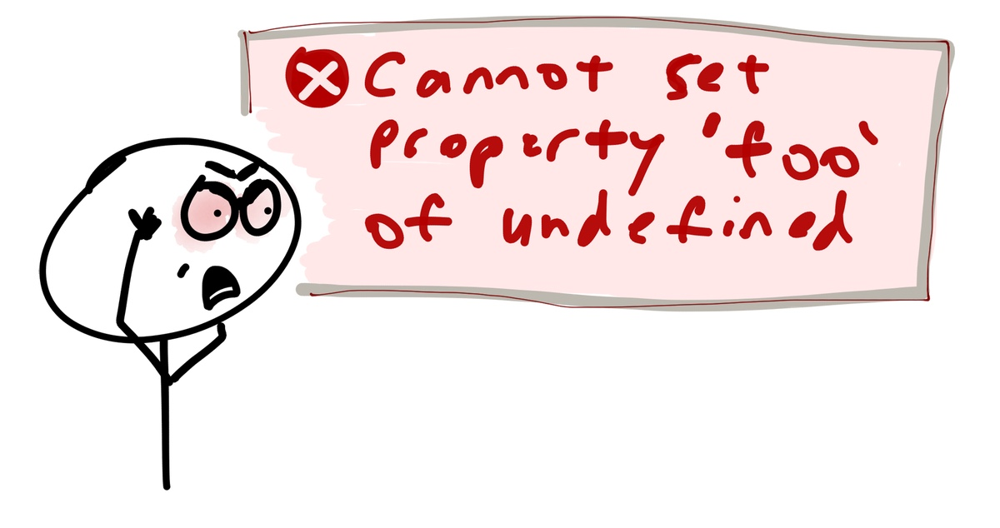

- title : Reading F#
- description : don't let syntax scare you
- author : Milosz Krajewski
- theme : beige
- transition : zoom

***

# Reading F#


### don't let syntax scare you

***

## Modern languages

|         | Classic     | Modern |
|---------|:-----------:|:------:|
| Native  | C/C++       | Rust   |
| iOS     | Objective-C | Swift  |
| JVM     | Java        | Scala  |
| Android | Java        | Kotlin |
| .NET    | C#          | F#     |

---

### What is the problem with F#?

> [...] biggest obstacles for F# [...] is that C# is a very good language. It's not like Swift vs Objective-C, where Swift is the obvious choice if you're not masochistic [...] -- [Thomas Bandt](https://thomasbandt.com/the-problem-with-fsharp-evangelism)

---

## F#

* multi-paradigm, functional first
* strongly typed with type inference
* low ceremony and concise
* expression based
* visually honest
* encourages composition

---

### Multi-paradigm, functional first

Supports both OO and FP...

...but FP is a little bit more natural in F#.

---

### Strongly typed with type inference

F# is so strongly typed that you can't even<br>
assign `int` to `double` variable without explicit conversion...

...but at the same time it infers types if it is possible,<br>
so you rarely specify them.

---

### Low ceremony

Ceremony and time pressure prevents things from being done right.

> [...] things you have to do before you can do what you really want to do [...] -- [Venkat Subramaniam](https://www.youtube.com/watch?v=4jCjDEb9KZI)

---

### Expression based

in F# everything is an expression.<br>
It makes you code very expressive (no pun, just a fact).

---

### Visual honesty

It does what it looks like.

---

### Conciseness

* every line of code is liability
* code not written don't have to be maintained
* less code has lower cognitive load (you can glance over it)
* write less code, deliver more is the same time
* logic fits one screen therefore it is easier to reason about

---

### Composition

Building isolated, easy to test small pieces which come together at the end.

---

### Venkay says...

| JVM   | .NET |
|:-----:|:----:|
| Java  | C#   |
| Scala | F#   |

***

## Primitive types

```fsharp
() // unit
true // bool
1234 // int
1234.5678 // float
"hello" // string
'c' // char
```

***

## 'let' Binding

```fsharp
let eight = 8
let hello = "Hello"
```

```javascript
// JS
const eight = 8;
const hello = "Hello";
```

---

```fsharp
let i = 1234
let f = 1234.5678
let s = "hello"
let c = 'c'
```

you can provide type if you really really want to

```fsharp
let i: int = 1234
let f: float = 1234.5678
let s: string = "hello"
let c: char = 'c'
```

***

## Void is a type

...and it has a value

```fsharp
let nothing: unit = ()
```

```javascript
// JS
const nothing = void 0 // undefined
```

The type is `unit` and value is `()`

---

### Need for void

Because `void` is not a real type in C#,<br>
lot of generic types and related methods<br>
are implemented twice:

* `Task` and `Task<T>`
* `Action` and `Func<T>`

---

While in fact:

* `Task` is just `Task<Void>`
* `Func<T>` is just `Func<Void, T>`
* `Action` is just `Func<Void, Void>`

---

It would be much easier if we could implement it just once:

for `Task<T>` and `Func<T, U>` respectively.

---

For example,<br>`Forgive` function needs to be implemented twice:

```csharp
void Forgive(Action action) {
    try { action(); } catch { /* ignore */ }
}

T Forgive(Func<T> action) {
    try { return action(); } catch { return default(T); }
}
```

...what if logic get's more complicated?

---

JavaScript just does not care:

```javascript
function forgive(action) {
    try { return action(); } catch(_) { }
};

forgive(() => 8); // 8
forgive(() => { throw "bang!" }); // undefined
```

(which in this case is acually useful)

---

Am I making shit up?

```csharp
public interface IServiceRestHelper
{
    Task<IRestResponse> SendRequest(
        IRestRequest request,
        ServiceType serviceType);
    Task<IRestResponse> SendRequest(
        IRestRequest request,
        ServiceType serviceType,
        int timeout);
    Task<IRestResponse<T>> SendRequest<T>(
        IRestRequest request,
        ServiceType serviceType) where T : new();
    Task<IRestResponse<T>> SendRequest<T>(
        IRestRequest request,
        ServiceType serviceType,
        int timeout) where T : new();
}
```

---

Am I?


---

## Everything is expression

As "void" is just a value, everything is an expression,<br>
even things you ususally don't expect to be:

```fsharp
let result = printfn "Hello!" // unit
```

---

It's like saying:

```csharp
// C#
var result = Console.WriteLine("Hello!");
```

and assigning `void` to `result`.

It doesn't have any particular significance<br>
until you need some generalization.

---

## Questions so far?

***

## Tuples

```fsharp
// Tuple<string, int>
let pair = "answer is", 42 // string * int
```

```fsharp
// Tuple<bool, string, char>
let triplet = true, "love", '!' // bool * string * char
```

---

### Construction

```fsharp
let tuple = "answer is", 42
```

```javascript
// JS
const tuple = ["answer is", 42]; // array
```

```csharp
// C#
var tuple = new Tuple<string, int>("answer is", 42);
var tuple = Tuple.Create("answer is", 42);
```

---

### Decomposition

```fsharp
let text, value = tuple
```

```javascript
// JS
const [text, value] = tuple; // array
```


```csharp
// C#
var text = tuple.Item1;
var value = tuple.Item2;
```

---

### Complex decomposition

```fsharp
let tuple = "answer is", 42
let (answer, number), pi = tuple, 3.14
```

---

```fsharp
let _, value = "no one cares", 1337 // string * int
let _, _, third = 1, 2, 3 // int * int * int
```

```javascript
// JS
let [_, value] = ["no one cares", 1337];
let [_, _, third] = [1, 2, 3]; // BANG! (runtime, of course)
```

---

```fsharp
let pair = "answer is", 42
let one, two, three = pair // compilation error
```

```javascript
const pair = ["answer is", 42];
let [one, two, three] = pair; // not a BANG!, just "undefined"
```

***

## Function types

Every function has one argument and result:

`Func<Request, Response>`

`Request -> Response`

---

|:----------------|-----------------------:|
| `Action`        | `Func<void, void>`     |
| `Action<T>`     | `Func<T, void>`        |
| `Func<T>`       | `Func<void, T>`        |
| `Func<A, B, C>` | `Func<Tuple<A, B>, C>` |
| `Func<A, B, C>` | `Func<A, Func<B, C>>`  |

---

### F#

`Func<A, B>`

is

`'A -> 'B`

---

| C#                     | F#                 |
|:----------------------:|:------------------:|
| `Action`               | `unit -> unit`     |
| `Action<T>`            | `'T -> void`       |
| `Func<T>`              | `unit -> 'T`       |
| `Func<Tuple<A, B>, C>` | `('A * 'B) -> 'C`  |
| `Func<A, Func<B, C>>`  | `'A -> ('B -> 'C)` |

---

Functions with many arguments in F# are either:

* `a -> b -> c -> d`
* `(a * b * c) -> d`

or combination of both:

* `a -> (b * c) -> d`

---

...you do this in JavaScript sometimes:

```javascript
let alice = (a, b, c) => { ... };
let frank = (a) => (b) => (c) => { ... };
let steve = (a) => (b, c) => { ... };
```

although in F# it is just bread-and-butter.

---

### Signatures

```fsharp
int -> string // toString 123
string -> float // parse "987"
int -> int -> string -> unit // drawPixel x y color
(int * int) -> string -> unit // drawPixel (x, y) color
unit -> double // nextRandom ()
HttpRequest -> Task<HttpResponse> // web server
```

---

### 'a -> 'b -> 'c

```fsharp
let multiply a b = a * b // int -> int -> int
multiply 5 6
```

```javascript
// JS - self-harm mode
function multiply(a) { return function(b) { return a * b; } };
multiply(5)(6); // 30
```

```javascript
// JS
const multiply = (a) => (b) => a * b;
multiply(5)(6); // 30
```

---

### Function's result

Because everyting is expression<br>
there is no `return` keyword<br>
last expression becomes a result

```fsharp
// float -> float -> float
let debugAndMultiply a b = // ? -> ? -> ?
    printfn "%g %g" a b // float -> float -> unit
    a * b // float
```

---

```fsharp
let multiply a b = a * b // int -> int -> int
let multiplyBy5 = multiply 5 // int -> int
multiplyBy5 6 // 30
```

```javascript
// JS
const multiply = (a) => (b) => a * b;
const multiplyBy5 = multiply(5);
multiplyBy5(6); // 30
```

---

### ('a * 'b) -> 'c

```fsharp
let multiply (a, b) = a * b // (int * int) -> int
multiply (5, 6) // 30
```

```javascript
// JS
const multiply = (a, b) => a * b;
multiply(5, 6);
```

---

```fsharp
let multiply (a, b) = a * b // (int * int) -> int
let multiplyBy5 x = multiply (5, x)
multiplyBy5 6 // 30
```

```javascript
// JS
const multiply = (a, b) => a * b;
const multiplyBy5 = (x) => multiply(5, x);
multiplyBy5(6); // 30
```

***

## Lambdas

Lambda is defined with `fun` keyword:

```fsharp
let multiply = (fun a b -> a * b)
```

```javascript
// JS
const multiply = (a, b) => a * b;
```

---

```fsharp
let multiply = fun a b -> a * b
let multiply a b = a * b
```

```javascript
const multiply = (a, b) => a * b
funtion multiply(a, b) { return a * b; }
```

---

```fsharp
let twice action = action (); action () // (unit -> unit) -> unit
twice (fun () -> printfn "Hello!")
```

***

## Operators (are functions)

```fsharp
let roundUpTo interval value =
    (value + interval - 1) / interval * interval
roundUpTo 10 9 // 10
roundUpTo 10 11 // 20
```

---

Operators are just functions with fancy names

```fsharp
let (^~) value interval = roundUpTo interval value
3 ^~ 10 // as infix operator
(^~) 3 10 // as function
```

(and some complicated precedence rules)

---

### Pipe operator

```fsharp
let (|>) arg func = func arg
```

```fsharp
printfn "%d" 42
42 |> printfn "%d"
```

```fsharp
roundUpTo 10 12
12 |> roundUpTo 10
```

---

The `|>` is used all the time, so instead:

```fsharp
let file = openFile fileName
```

you can often see:

```fsharp
let file = fileName |> openFile
```

(maybe not in such simple case)

---

when functions return more than one result (as tuple)<br>
you can untangle them and pass separetely:

```fsharp
// ('a * 'b) -> 'c
let alice p =
    let (b, s) = p
    printfn "%b %s" b s
let frank (b, s) = printfn "%b %s" b s

// 'a -> 'b -> 'c
let steve b s = printfn "%b %s" b s

let pair = (true, "love")
pair |> alice
pair |> frank
pair ||> steve // note double pipe
pair ||> printfn "%b %s"
```

---

### Compose operator

Compose operator 'composes' two functions, without applying any arguments.
It's combine two functions by creating third one:

```fsharp
// combines functions f and g, by creating third one taking x
let (>>) f g = fun x -> x |> f |> g
let (>>) f g = fun x -> g (f x)
let (>>) f g x = g (f x)
```

```javascript
const combine = (f, g) => (x) => g(f(x));
```

---

```fsharp
let (>>) f g = fun x -> x |> f |> g

let square x = x * x
let negate x = -x
let square_then_negate = square >> negate;
square_then_negate(7) |> printfn "%d"
```

```javascript
const combine = (f, g) => (x) => g(f(x));

const square = (x) => x * x;
const negate = (x) => -x;
const square_then_negate = combine(square, negate);
console.log(square_then_negate(7));
```

---

```fsharp
(f >> g) x
x |> (f >> g)
x |> f |> g
g (f x)
f x |> g
```

***

## Visual honesty


---

C# is generally left-to-right and top-down, but has islands of right-to-left'isms and bottom-up'isms:

```csharp
SendEmail(
    GenerateEmailFromTemplate(
        "YouHaveBeenSelectedTemplate",
        GetPersonsEmailAddress(
            FindPersonById(id))));
```

---

Which looks like that:


---

F# helps to sort this out using `|>` operator:

```fsharp
id
|> findPersonById
|> getPersonsEmailAddress
|> generateEmailFromTemplate "YouHaveBeenSelectedTemplate"
|> sendEmail
```

---

Which makes it:


---

although, it is binary identical to:

```fsharp
sendEmail (
    generateEmailFromTemplate "YouHaveBeenSelectedTemplate" (
        getPersonsEmailAddress (
            findPersonById id)))
```

---

### ...BTW...

---

### Pipeline is making its way to JavaScript

[Pipeline operator](https://github.com/tc39/proposal-pipeline-operator)

```javascript
const doubleSay = s => s + ", " + s;
const capitalize = s => s[0].toUpperCase() + s.substring(1);
const exclaim = s => s + '!';
```

```javascript
let resultA = exclaim(capitalize(doubleSay("hello")));
let resultB = "hello" |> doubleSay |> capitalize |> exclaim;
```

---

Without pipeline operator,<br>
there is no easy way to even format this:

```javascript
foreach(
    map(
        filter(people, p => p.Name === "John"),
        p => p.email),
    e => invite(e));
```

---

while pipeline'ing makes it very readable:

```javascript
people
    .filter(p => p.Name === "John")
    .map(p => p.email)
    .foreach(e => invite(e));
```

***

## Indentation


---


---

What would this code print?

```fsharp
let mutable (x, y) = 0, 1
for i = 1 to 8 do
    x <- x + 1
    y <- y * 2
printfn "%d,%d" x y
```

vs

```csharp
int x = 0, y = 1;
for (var i = 1; i <= 8; ++i)
    x = x + 1;
    y = y * 2;
Console.WriteLine("{0},{1}", x, y);
```

***

## Lists

`[1; 2; 3]`

---

```fsharp
let empty = []
let listA = [1; 2; 3]
let listB = [
    1
    2
    3
]
```

---

```fsharp
let slightlyLonger = 7 :: [1; 2; 3] // add 1 item
let slightlyLonger = [7] @ [1; 2; 3] // add a list (with 1 item)
let slightlyLonger = 7 :: 1 :: 2 :: 3 :: [] // add many one by one
```

```fsharp
let muchLonger = [9; 8; 7] @ [1; 2; 3] // add lists
let muchLonger = 9 :: [8; 7] @ (1 :: 2 :: [3]) // get crazy
```

***

## Records

```fsharp
type Person = {
    FirstName: string
    LastName: string
    Age: int
}
```

or

```fsharp
type Person = { FirstName: string; LastName: string; Age: int }
```

---

### Constructing

```fsharp
let frank = { FirstName = "Frank"; LastName = "Smith"; Age = 21 }
```

```javascript
const frank = { firstName: "Frank", lastName: "Smith", age: 21 }
```

---

### Cloning

```fsharp
let alice = { frank with FirstName = "Alice" } // twin
```

```javascript
const alice = { ...frank, firstName: "Alice" } // twin
```

---

### Deconstructing

```fsharp
let { LastName = franksName; Age = franksAge } = frank
```

```javascript
const { lastName: franksName; age: franksAge } = frank
```

---

***

## Unions

...are like enums

```csharp
public enum Suit {
    Club,
    Diamond,
    Heart,
    Spade
}
```

```fsharp
type Suit =
    | Club
    | Diamond
    | Heart
    | Spade
```

---

...but they are also like class hierarchies.

Let's say we handle 4 payment methods:

```csharp
public enum PaymentMethod {
    Cash,
    CreditCard,
    BankTransfer,
    Paypal
}
```

---

... and we need to store details of those payments.

```csharp
public abstract class PaymentDetails
{
    public abstract PaymentMethod Method { get; }
}
```

---

```csharp
public class CashPayment: PaymentDetails
{
    public override PaymentMethod Method => PaymentMethod.Cash;
}
```

---

```csharp
public class CreditCardPayment: PaymentDetails
{
    public override PaymentMethod Method => PaymentMethod.CreditCard;

    public string CardNumber { get; }

    public CreditCard(string cardNumber)
    {
        CardNumber = cardNumber;
    }
}
```

---

```csharp
public class BankTransferPayment: PaymentDetails
{
    public override PaymentMethod Method => PaymentMethod.BankTransfer;

    public string SortCode { get; }
    public string AccountNumber { get; }

    public CreditCard(string sortCode, string accountNumber)
    {
        SortCode = sortCode;
        AccountNumber = accountNumber;
    }
}
```

---

```csharp
public class PaypalPayment: PaymentDetails
{
    public override PaymentMethod Method => PaymentMethod.Paypal;
    public string Email { get; }
    public PaypalPayment(string email)
    {
        Email = email;
    }
}
```

---

It can be also modelled with single class:

```csharp
public abstract class PaymentDetails
{
    public PaymentMethod Method { get; }
    public string CardNumber { get; }
    public string SortCode { get; }
    public string AccountNumber { get; }
    public string Email { get; }

    // ...
}
```

---

with catch-all constructor:

```csharp
{
    // ...

    protected PaymentDetails(
        PaymentMethod method,
        string cardNumber = null,
        string sortCode = null, string accountNumber = null,
        string email = null)
    {
        Method = method;
        CardNumber = cardNumber;
        SortCode = sortCode;
        AccountNumber = accountNumber;
        Email = email;
    }

    // ...
```

---

and some static methods:

```csharp
{
    // ...

    public static PaymentDetails FromCash() =>
        new PaymentDetails(PaymentMethod.Cash);

    public static PaymentDetails FromCreditCard(string cardNumber) =>
        new PaymentDetails(
            PaymentMethod.CreditCard, cardNumber: creditCard);

    public static PaymentDetails FromBankTransfer(
        string sortCode, string accountNumber) =>
        new PaymentDetails(
            PaymentMethod.BankTransfer,
            sortCode: sortCode, accountNumber: accountNumber);

    public static PaymentDetails FromCreditCard(string cardNumber) =>
        new PaymentDetails(
            PaymentMethod.CreditCard, cardNumber: creditCard);

    public static PaymentDetails FromPaypal(string email) =>
        new PaymentDetails(
            PaymentMethod.Paypal, email: email);
}
```

---

...or...

---

```fsharp
type PaymentDetails =
    | Cash
    | CreditCard of string
    | BankTransfer of sortCode: string * accountNumber: string
    | Paypal of email: string
```

---

Maybe this looks more familiar...

---

```fsharp
type Comment =
    | Chat of byte[]
    | Quick of string
    | Nudge
    | Accept
    | Decline
    | Requote of (decimal * decimal)
    //...
```

***

## Option



---

### Billion dollar mistake

> Uglier than a Windows backslash, odder than ===, more common than PHP, more unfortunate than CORS, more disappointing than Java generics, more inconsistent than XMLHttpRequest, more confusing than a C preprocessor, flakier than MongoDB, and more regrettable than UTF-16, the worst mistake in computer science was introduced in 1965. -- [The worst mistake of computer science](https://www.lucidchart.com/techblog/2015/08/31/the-worst-mistake-of-computer-science/)

---

> I call it my billion-dollar mistake. [...] I was designing the first comprehensive type system for references in an object oriented language. My goal was to ensure that all use of references should be absolutely safe, with checking performed automatically by the compiler. But I couldn't resist the temptation to put in a null reference, simply because it was so easy to implement. This has led to innumerable errors, vulnerabilities, and system crashes, which have probably caused a billion dollars of pain and damage in the last forty years. -– *Tony Hoare, inventor of ALGOL*

---


(because it's just not nice to cancel after null null)

---

* Nullable types
* Null coalescing operator
* Null object pattern

---

```csharp
public void SendEmail(Person person, Content contect)
{
    if (person == null)
    {
        throw new ArgumentNullException("person");
    }
    if (content == null)
    {
        throw new ArgumentNullException("content");
    }
    // do it!
}
```

...8 "cereminial" lines, repeated everywhere...

---

```csharp
protected Comment LastComment(Func<Comment, bool> predicate = null) =>
    Prompt.Comments? // <- can be null
        .Where(predicate ?? (_ => true)) // <- can be null
        .DefaultIfEmpty() // <- can be empty
        .MaxBy(c => c?.Created) // <- can be null
        .MaxBy(c => c?.CommentId) // <- can be null
        .LastOrDefault(); // <- may be null

public DateTime LastUpdated =>
    LastComment()?.Created ?? Prompt.Created; // <- can be null
```

---

```javascript
const firstName = (
  person &&
  person.profile &&
  person.profile.name &&
  person.profile.name.firstName
)
```

---

```fsharp
type Option<'a> =
    | Some of 'a
    | None
```

***

### Single case unions

> [...] Primitive Obsession is using primitive data types to represent domain ideas. For example, we use a String to represent a message, an Integer to represent an amount of money, [...] -- http://wiki.c2.com/?PrimitiveObsession

---

```csharp
public void AddComment(
    Guid promptId, Guid senderId, Guid commentId)
{
    // ...
}
```

---

```csharp
AddComment(senderId, promptId, commentId); // Runtime BANG!
```

---

```fsharp
type UserId = | UserId of Guid
type PromptId = | PromptId of Guid
type CommentId = | CommentId of Guid

let addComment (prompt: PromptId) (sender: UserId) (comment: CommentId) =
    ignore
```

---

```fsharp
type Email = | Email of string
module Email =
    let isValid email = true // test
    let create (email: string) =
        if isValid email
        then Email email
        else failwithf "%s: not valid email address" email
    let value (Email email) = email
```

Since now, there are no non-validated email in your app.<br>
If it is `Email` it was already validated and already failed<br>
if it wasn't correct.

---

***

## if else match

## bait and switch

## for

## recursion


## Composition and abstraction reuse

```javascript
function sum(numbers) {
    let result = 0;
    for (let i = 0; i < numbers.length; i++) {
        result = result + numbers[i];
    }
    return result;
}
```

```javascript
function concat(strings) {
    let result = "";
    for (let i = 0; i < numbers.length; i++) {
        result = result + strings[i];
    }
    return result;
}
```

reduce: max, sum, join,

pit of success
expression based
jupyter
indentation
visual honesty
Func<A, B>
[x; y]
(x, y)
|> >>
switch/match
try/catch/finally
if

Math.cap extension
simon cousins
concise/more code on screen

quick-sort

lists
unions
    type safety
unions with one case
    type safety
if
match
try/catch
rpn
sort
json

"F# ... Structural equ... bla bla bla ... Discriminated... bla bla bla"

C# is not that shit,

```csharp
protected Guid GetOrCreateUserId(string userKey)
{
    if (UserIds.ContainsKey(userKey))
    {
        return UserIds[userKey];
    }

    var userId = Guid.NewGuid();
    UserIds.Add(userKey, userId);

    return userId;
}
```

---

## 'let' binding as expression

**Problem**

```fsharp
let squared = func () * func ()
```

(if there was no `pow` nor `sqr`)

---

**Solution**

Let's use temporary variable:

```fsharp
let temp = func ()
let squared = temp * temp
```

and use is as part of expression:

```fsharp
let squared = (let temp = func() in temp * temp)
```

brackets are not really required,<br>
but it is easier to read

---

As scope of temp variable is minimal,
we can use just `t`:

```fsharp
let squared = let t = func() in t * t
```

> Variable names like `i` and `j` are just fine if their scope is five lines long. -- [**Mark Seemann**](http://blog.ploeh.dk/2015/08/17/when-x-y-and-z-are-great-variable-names/)

---

You actually can do this in JavaScript,<br>
looks a unnatural, but work fine:

```javascript
const squared = (t => t * t)(func());
```

```fsharp
let squared = (fun t -> t * t)(func());
```

```fsharp
let squared = func() |> fun t -> t * t;
```

---

```javascript
function test(request) { console.log(request); } // no 'return'
let response = test(); // argument not given
```

will print:

```javascript
undefined
undefined
```

---

```fsharp
let rec repeat i x y = match i with | 0 -> x, y | _ -> repeat (i - 1) (x + 1) (y * 2)
(0, 1) ||> repeat 8 ||> printfn "%d,%d"
```


Problems solved:
* void is a type so you can yes generics once
* strongly typed so you make less mistakes
* type inference so you type less
* low ceremony so it is easy to start


try, match, if, throw, is an expression
Option.alt vs ||
ServiceRestHelper as single function

### Multi-paradigm

Supports both OO and FP...

---

### Functional first

...but FP is a little bit more natural in F#.

---

### Strongly typed

F# is so strongly typed that even this does not compile:

```fsharp
let value: float = 3
```

because

```csharp
var value = long.MaxValue;
if (value != (long)(double)value)
    throw new InvalidOperationException("No worky!");
```

---

### Type inference

At the same time if guesses types, so you rarely specify them:

```fsharp
let weird x y a b = if x && y < 7.4 then max a b else b
```

it just knows that this function is:

```csharp
T Weird<T>(bool x, double y, T a, T b) where T: IComparable { ... }
```

---


x = switch (...)
temp variable, fancy break, iife with return
constructor without new


Programs should be written for people to read, and only incidentally for machines to execute.
-- from "Structure and Interpretation of Computer Programs" by Abelson and Sussman

“Any fool can write code that a computer can understand. Good programmers write code that humans can understand.” -- Martin Fowler, "Refactoring: Improving the Design of Existing Code"

```javascript
function functionA() {
    let variable;
    if (condition) { // 'if' is a statement
        variable = expressionA();
    } else {
        variable = expressionB();
    };
    return functionB(variable);
}
```

```javascript
const functionA = // '?:' is expression
    () => functionB(condition ? expressionA() : expressionB());
```

```csharp
File
    .Open("people.csv")
    .ReadAllLines()
    .Select(line => Person.Parse(line))
    .Where(person => person.Age > 60)
    .Where(person => Email.IsValid(person.email))
    .Select(person => Template.Build(person.email))
    .ForEach(email => Email.Send(email));
```

No return keyword

```fsharp
fun text -> parse 10 text
parse 10
```

a |> b |> c
a |> (b >> c)


private void ApplyEvent(object obj)
{
    switch (obj)
    {
        case int v:
            OnNumber(v);
            break;
        case double v:
            OnNumber(v);
            break;
        case string o:
            OnAction(o);
            break;
    }
}
